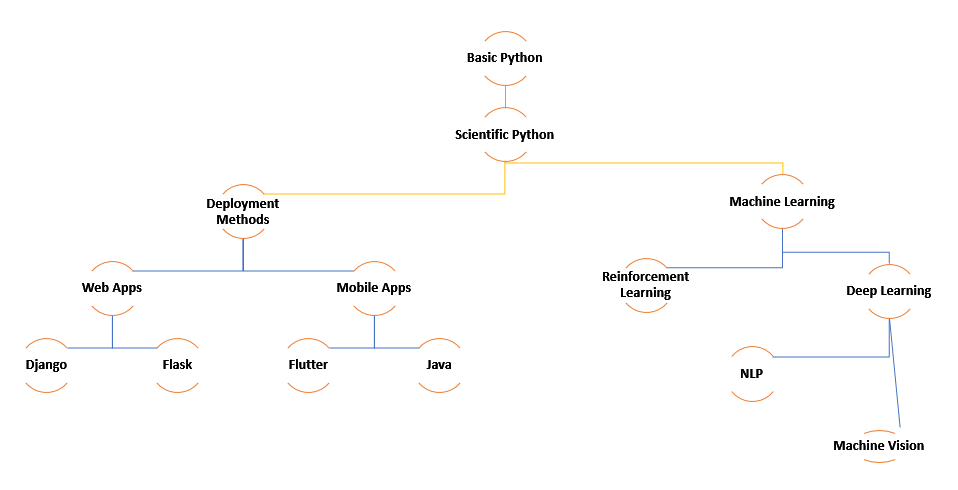

# McCarthy-AI-Roadmap
Roadmap to learn AI for associates at McCarthy Lab@[Next Tech Lab](https://nextech.io/home)

> Dependency Tree

# Primer
## 1. <u>Data Science Stack</u>
> Best places to learn - https://www.python-course.eu/  , https://www.datacamp.com/ , https://www.pythonprogramming.net/
+ Python
+ NumPy
+ Pandas
+ Matplotlib and Seaborn
+ scikit-learn 
+ SciPy

## 2. <u>Technology Stack</u>
+ Basic computer architecture:
    + [GPU vs CPU](https://blogs.nvidia.com/blog/2009/12/16/whats-the-difference-between-a-cpu-and-a-gpu/)
    + [File Systems](https://wiki.microfocus.com/index.php/File_System_Primer)
+ [Linux](https://www.digitalocean.com/community/tutorials/an-introduction-to-linux-basics)
+ [Containers - Docker](https://docs.docker.com/engine/docker-overview/)
+ [Bash Cheatsheet](https://devhints.io/bash)
+ [Git-Introduction](https://readwrite.com/2013/09/30/understanding-github-a-journey-for-beginners-part-1/) 

## 3. <u>Deep Learning Frameworks </u>
+ [PyTorch](https://pytorch.org/tutorials/) 
    + Use [fast.ai](https://docs.fast.ai/training.html) as High level wrapper
+ [TensorFlow](https://www.tensorflow.org/tutorials/)
    + Use [tf.keras](https://www.tensorflow.org/guide/keras) as a High level wrapper

## 4.Reinforcement Learning - Libraries
+ [TensorLayer](https://github.com/tensorlayer/tensorlayer)
+ [Keras-RL](https://github.com/keras-rl/keras-rl)

# Mooc Resources

## <u>Data Structures and Algorithms</u>
+ [Stanford ALgorithms - Coursera](https://www.coursera.org/specializations/algorithms) or
+ [Introduction to Algorithms (MIT 6.006)](https://ocw.mit.edu/courses/electrical-engineering-and-computer-science/6-006-introduction-to-algorithms-fall-2011/)
+ [Introduction to Computational Thinking and Data Science (MIT 6.0002)](https://ocw.mit.edu/courses/electrical-engineering-and-computer-science/6-0002-introduction-to-computational-thinking-and-data-science-fall-2016/) 
+ Learn any one programming language really well and compete on Codechef, Hackerrank, HackerEarth,etc

## <u>Machine Learning/AI MOOCs</u>
+ [Machine Learning - Coursera](https://www.coursera.org/learn/machine-learning)
+ [UC Berkeley CS188](https://inst.eecs.berkeley.edu/~cs188/fa18/) or
+ [MIT 6.034](https://ocw.mit.edu/courses/electrical-engineering-and-computer-science/6-034-artificial-intelligence-fall-2010/lecture-videos/)

Note :
+ Implement Machine Learning models from scratch using Python
+ Once you're comfortable implementing models from scratch, learn scikit-learn and compare performance
+ Practice on Kaggle to get your skiills ---> :sunglasses:

## Deep Learning MOOCs
+ [TensorFlow in Practice Specialization - Coursera](https://www.coursera.org/specializations/tensorflow-in-practice?)
+ [fast.ai](http://www.fast.ai/)
+ [Stanford University's CS224n - NLP](https://www.youtube.com/watch?v=OQQ-W_63UgQ&list=PL3FW7Lu3i5Jsnh1rnUwq_TcylNr7EkRe6)

## Reinforcement Learning Tutorials
+ [David Silver](https://www.youtube.com/watch?v=2pWv7GOvuf0&list=PL7-jPKtc4r78-wCZcQn5IqyuWhBZ8fOxT)
+ [Practical Reinforcement Learning](https://www.coursera.org/learn/practical-rl)
+ [Practial RL - Yandex Data School](https://github.com/yandexdataschool/Practical_RL)

## Deploying/Shipping Projects:
<b> Feel free to use any of these frameworks, all are not required </b>
+ [Full Stack Deep Learning](https://fullstackdeeplearning.com/)
+ [TensorFlow: Data and Deployment Specialization](https://www.coursera.org/specializations/tensorflow-data-and-deployment?)
+ [Django](https://docs.djangoproject.com/en/3.0/intro/tutorial01/)
+ [Flask](https://www.tutorialspoint.com/flask/index.htm)
+ [Flutter](https://www.tutorialspoint.com/flutter/index.htm)

# Books and Further reading material

## Machine Learning Books for reference
+ [Introduction to Statstical Learning](https://www-bcf.usc.edu/~gareth/ISL/)
+ [Elements of Statistical Learning](https://web.stanford.edu/~hastie/Papers/ESLII.pdf) (A little more in-depth than ISLR)
+ [Pattern Recognition And Machine Learning](http://users.isr.ist.utl.pt/~wurmd/Livros/school/Bishop%20-%20Pattern%20Recognition%20And%20Machine%20Learning%20-%20Springer%20%202006.pdf)

Note : Learn from official tutorials/docs or GitHub repos which have detailed notebooks like [Hvass Labs](https://github.com/Hvass-Labs/TensorFlow-Tutorials)

## Deep Learning Books
+ [Deep Learning Book](http://www.deeplearningbook.org/)

## Mathematics for Machine Learning
+ [The Matrix Calculus You Need For Deep Learning - - Quick refresher](https://arxiv.org/pdf/1802.01528) 
+ [Mathematics for Machine Learning - Intermediate ](https://mml-book.github.io/) 
+ [Numerical Algorithms - Advanced](https://people.csail.mit.edu/jsolomon/share/book/numerical_book.pdf) 

## Natural Language Processing 
+ [Natural Language Processing by National Research University Higher School of Economics](https://www.coursera.org/learn/language-processing)
+ [NLP course by Yandex Data School](https://github.com/yandexdataschool/nlp_course)

## Reinforcement Learning Books
+ [Reinforcement Learning – An Introduction](https://drive.google.com/file/d/1opPSz5AZ_kVa1uWOdOiveNiBFiEOHjkG/view)

## Read blogs, Reddit, follow researchers on Twitter
+ [Towards Data Science](https://towardsdatascience.com/)
+ [Sebastian Ruder](http://ruder.io/)
+ [montreal.ai](https://montrealartificialintelligence.com/)
+ [thegradient](https://thegradient.pub/)
+ [Reddit - Machine Learning](https://www.reddit.com/r/MachineLearning/)
+ [Reddit - Deep Learning](https://www.reddit.com/r/deeplearning/)
+ [https://github.com/ujjwalkarn/Machine-Learning-Tutorials](https://github.com/ujjwalkarn/Machine-Learning-Tutorials)

# Podcasts to Follow Interesting Developments In The Field 

+ [TWIML AI Podcast](https://twimlai.com/tag/podcast/)
+ [The Data Skeptic ](https://open.spotify.com/show/1BZN7H3ikovSejhwQTzNm4?si=gv3IrtPzQs6F9phaHDGpSQ)
+ [The AI Podcast - Nvidia](https://soundcloud.com/theaipodcast)
+ [Artificial Intelligence with Lex Fridman, MIT AI](https://open.spotify.com/show/2MAi0BvDc6GTFvKFPXnkCL) 
+ [Linear Digressions](http://lineardigressions.com/)

#### Feel free to make Pull Requests stating why that particular resource should be added.
